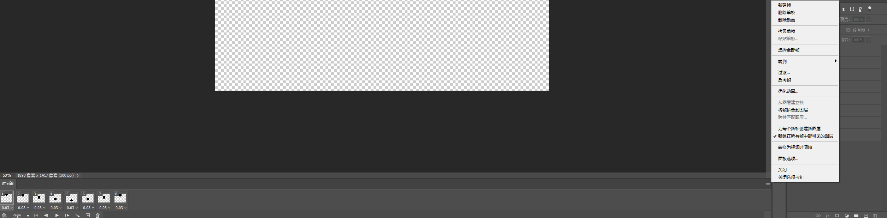
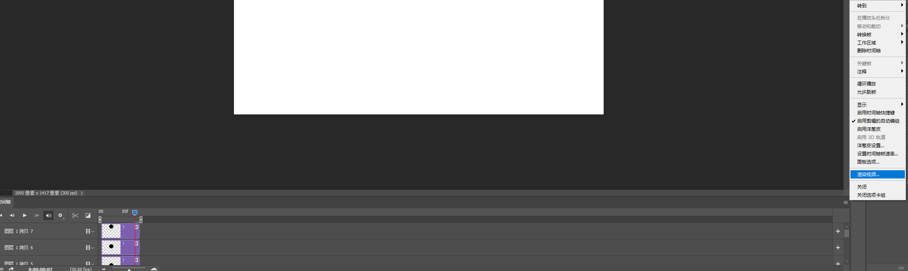

#### 帧动画

###### 合成帧动画


> 处理渲染视频过程中，出现的单帧图片合成视频

1. 文件>脚本>将文件载入堆栈>浏览>选择文件夹>确定

2. 创建视频时间轴

3. 转换为帧动画

4. 从图层建立帧（反向帧改变顺序）

   

5. 渲染视频

   

#### 水印处理

1. 创建动作，新建名字，记录
2. 打开文件
3. 拖入logo

###### 去水印

###### 内容识别法去水印

###### 色阶法去水印

1. 白底黑字

   > Ctrl+L拖动色阶滑块

2. 彩色试卷水印

> 框选水印
>
> Ctrl+Shift+U——去色

###### 消失点法去水印

- 滤镜——消失点（Alt+Ctrl+V）——透视选框——

###### 反相混合法

> 在白色底的图片上，选择
>
> 适用于白色背景且半透明的水印

###### 借鉴法

> 修补工具

###### 多技能组合法+

###### 水印添加

> 编辑——定义图案——输入名称
>
> 打开图片
>
> 编辑——填充（Shift+F5）
>

——————————

> 去除水印
>
> 在空白处，扣取水印，Ctrl+I反相，选择颜色减淡
>
> 去除水印2

#### 正版弹窗处理

###### 修改hosts

> C:\Windows\System32\drivers\etc
>
> ```shell
> 127.0.0.1 adobe.io
> ```

1. 火绒——防护中心——系统防护
2. 流量监控
3. 里面禁止PS联网，禁止Imgrd.exe联网就解决了

```
软件网站
http://www.rjgxgj.com/
```

#### 照片处理

###### 处理图片拍摄时光影明暗

> 复制两层
>
> 第二层——滤镜>>模糊>>平均
>
> 第三层——滤镜>>其他>>高反差保留
>
> 第三层——线性光，透明度调整一些
>
> 合并第二、三层，适当调节色阶，增加对比度

###### 人像清晰度调整

- 复制一层
- 去色，滤镜——高反差保留（10像素）
- 线性光

###### 衣服褶皱处理

- Ctrl+J复制一层低频层，一层高频层
- 关闭高频层，操作低频层，滤镜——模糊——高斯模糊，调整数值
- 打开高频层，图像——应用图像，图层选择低频层，混合模式选择减去，（数值2，补偿值128），确定，叠加模式改为线性光。

> 思路——通过处理低频层和高频层来处理衣服的褶皱

- 高频层——叠加模式改为正常，选择污点修复画笔工具，进行褶皱去除
- 关闭高频层，对低频层进行处理 ，混合器画笔工具，（潮湿83，载入60，混合85，流量100）

> 效果不好的话可以用仿制图章，对低频层操作

###### 提取线稿

> 按ctrl+j复制文件，在复制文件操作，以免破坏原图
>
> Ctrl+Shift+U，去色
>
> Ctrl+J复制一层，模式选择颜色减淡，滤镜选择最小值（最好将最上面的图层转换为智能对象方便修改）

#### 颜色处理

###### 1.彩色换白色

给换色区域制作（建立选区）

选择最接近白色的通道

Ctrl+A选择，回到图层，新建一层，Ctrl+V粘贴——需要多重复几次

>  1.此步骤无法实现，问题需要解决

###### 2.彩色调黑色

调整色相，饱和度，拉低饱和度

调整曲线，压低曲线

> 第二种方法

添加黑白层

添加色相/饱和度，拉低明度

双击色相饱和度图层，混合选项中，混合颜色带，调整下一图层`白色滑块`，（按住`Alt`键，拉动滑块的一半）

###### 3.彩色调整白色

以上方法，色相饱和度>明度，明度调高

混合颜色带，调整黑色区滑块

###### 4.彩色调其他彩色

调整色相/饱和度，调整下面的颜色

#### 快捷键

###### 文件处理

文件——Alt+F

新建文件——Ctrl+N

打开文件——Ctrl+O

在Bridge中浏览——Alt+Ctrl+O

打开为智能对象

最近打开文件——Alt+F+T

打开为——Alt+Shift+Ctrl+O

关闭——Ctrl+W

关闭全部——Alt+Ctrl+W

关闭其他——Alt+Ctrl+P

关闭并转到Bridge——Shift+Ctrl+W


编辑——Alt+E

图像——Alt+I

图层——Alt+L

文字——Alt+Y

选择——Alt+S

滤镜————Alt+T

3D——Alt+3

视图——Alt+V

增效工具

窗口——Alt+W

帮助——Alt+H